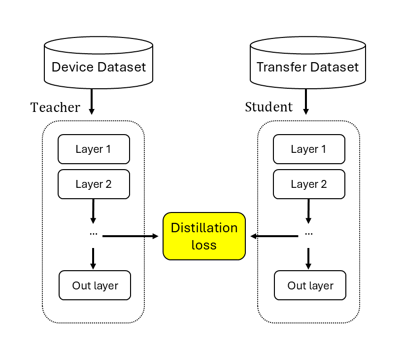

<div  align="center">

# kd-audio-fx

| [Paper]() | [Audio examples]() | [Plugins](#plugins) |

Compressing Neural Network Models of Audio Distortion Effects Using Knowledge Distillation Techniques, presented at the AES International Conference on Artificial Intelligence and Machine Learning in Audio, 2025 September 8–10, London, UK




</div>

## Short introduction

Knowledge distillation is an ML compression technique where knowledge from larger "teacher" networks are distilled into smaller "student" networks. We explore how knowledge distillation can be used to optimize virtual-analog models of audio distortion effects. In particular, we consider an audio-to-audio LSTM architecture for real-time regression tasks where student networks are trained to mimic the internal representations (features) of teachers, known as feature-based knowledge distillation.

This repo contains all the necessary utilities to use our knowledge distillation architecture. Find the code, pre-trained models and VST plugins located inside the "./src" folder.

## Datasets

Our distillation architecture was evaluated on three datasets: the Blackstar HT-1 vacuum tube amplifier (HT-1), Electro-Harmonix Big Muff (Big Muff) guitar pedal, and the analog-modeled overdrive plugin DrDrive. 

The DrDrive datasets (conditioned and unconditioned) created for this article can be accessed via [Zenodo](https://doi.org/10.5281/zenodo.15222630). The HT-1 and Big Muff datasets were sourced from the IEEE journal article [Pruning Deep Neural Network Models of Guitar Distortion Effects](https://ieeexplore.ieee.org/abstract/document/9954902/) by David Südholt, Alec Wright, Cumhur Erkut, and Vesa Valimaki, 2023.

To use our codebase, put all datasets go in the "src./datasets" folder. Next, seperate the testing and training sets into individual pickles and use the following naming convention; "device_dk_type.pickle".

Example:
```
./src
├── code
├── datasets
│   ├── drdrive_cond_dk_test.pickle
│   ├── drdrive_cond_dk_train.pickle
│   ├── drdrive_dk_test.pickle
│   └── drdrive_dk_train.pickle
├── models
└── realtime
```

Note that the naming of the datasets correspond directly to the naming of the models (./src/models) produced by the training.

## Pre-trained models

The " ./src/models " folder contains a selection of pre-trained teacher and student models. Although both conditioned and unconditioned versions are listed, conditioned models currently exist only for DrDrive.
```
./src
├── code
├── datasets
├── models
│   ├── students_distilled
│   ├── students_distilled_by_64_student
│   ├── students_non_distilled
│   └── teachers 
└── realtime
```

Student models are either *non_distilled*, trained on the normal training data, or *distilled*, trained on transfer data generated by a teacher model (+ the normal test sets). Further, students are constructed with only two LSTM layers in addition to their input and output dense layers. The size of the first LSTM layer is customizable through user arguments (see "how to run") while the second layer is always 8 units big. 

The naming of the models aim to capture the architecture (LSTM), the device used (f.ex drdrive) and how many units are in the second LSTM layer.

Example:
```
cd ./models/students_distilled
LSTM_drdrive_dk_8
LSTM_drdrive_dk_16
LSTM_drdrive_dk_32
LSTM_drdrive_dk_64
LSTM_drdrive_cond_dk_8
LSTM_drdrive_cond_dk_16
etc..
```

Finally, one experimental model is included in the "./src/models/students_distilled_by_64_student" folder. In this case, smaller student models (8 units) have been trained by a larger student model (64 units), instead of teachers.


## Training

First, install Python dependencies:
```
cd ./src/code
pip install -r requirements.txt
```

Next, choose to train a teacher, distilled student, or non-distilled student network. Recommended order of operations:
1. Load datasets into the datasets folder
2. Train the teacher model
3. Create transfer dataset from teacher model (create_transferset)
4. Train non-distilled and distilled student models for comparisons.

Every subfolder inside ".src/code/" contains its own starter script for training and running inference from the terminal. The starter scripts also contain necessary documentation on available arguments.

The code folder structure:
```
./src
├── code    
│   ├── requirements.txt
│   ├── create_transferset 
│   ├── students_distilled 
│   ├── students_non_distilled
│   └── teachers
│       └── starter.py
├── datasets
├── models
└── realtime
``` 

Available options (some apply only to students or teachers): 
* --model_save_dir - Folder directory in which to store the model and all other results (loss). [str] (default ="./src/models")
* --data_dir - Folder directory in which the datasets are stored [str] (default="./src/datasets")
* --datasets - The names of the datasets to use. For instance, "drdrive_dk" for unconditional training and "drdrive_cond_dk" for conditional training. [ [str] ] (default=["drdrive_dk"] )
* --epochs - Number of training epochs. [int] (defaut=60)
* --conditioning - Flag True for training with conditioned data, False for unconditioned. [bool] (default=False)
* --input_dim - Input dimension of the training data. [int] (default=1)
* --batch_size - The size of each batch [int] (default=8 )
* --hidden_layer_sizes = The hidden layer size (amount of units) of the LSTM network. To train multiple networks with different hidden layer sizes, simply select more than one value. for instance, "--hidden_layer_size 8 16 32" will train three separate networks, each with different units. [ [int] ] (default=[8])
* --mini_batch_size - The mini batch size [int] (default=2048)
* --learning_rate - the initial learning rate [float] (default=3e-4)
* --only_inference - When True, skips training and runs only inference on the pre-model. When False, runs training and inference on the trained model. [bool] (default=False)

Example training case: 
```
cd ./src/code/students_non_distilled

# unconditioned
python starter.py --datasets drdrive_dk --epochs 500

# conditioned
python starter.py --datasets drdrive_cond_dk --conditioning True --epochs 500 --input_dim 2 
```

To only run inference on an existing pre-trained model, use the "only_inference". In this case, ensure you have the existing model and dataset (to use for inference) both in their respective directories with corresponding names.

Example inference case:
```
cd ./src/code/teachers
python starter.py --datasets drdrive_dk --only_inference True
```

## Plugins

Our distillation models are also avaliable as real-time VST plugins to use in DAWs and other musical contexts. All necessary files for the VSTs can be found in the ```./src/realtime``` directory. 

### Neutone

The ./realtime/neutone-vst folder contains pre-built models and scripts for using a selection of our distilled student models as VSTs within the [Neutone](https://neutone.ai/) environment, built with the [Neutone SDK](https://github.com/Neutone/neutone_sdk).

```
./src
├── code    
├── datasets
├── models
└── realtime
    └── neutone-vst
        ├── models (pre-built neutone models)
        ├── requirements.txt
        ├── models.py
        ├── utils.py
        └── starter.py
```

To use our Neutone models, download the Neutone FX VST and load the desired model files (.nm) from the ```./neutone-vst/models``` directory via the plugin interface.

For development, install the dependencies listed in ```./neutone-vst/requirements.txt```, and update the CONFIG settings in starter.py as needed. Then, follow the four steps outlined in the starter file:
1. Save the Keras weights locally
2. Convert the Keras weights to PyTorch
3. Verify that the Keras and PyTorch models produce identical outputs
4. Generate a Neutone model from the PyTorch model 
