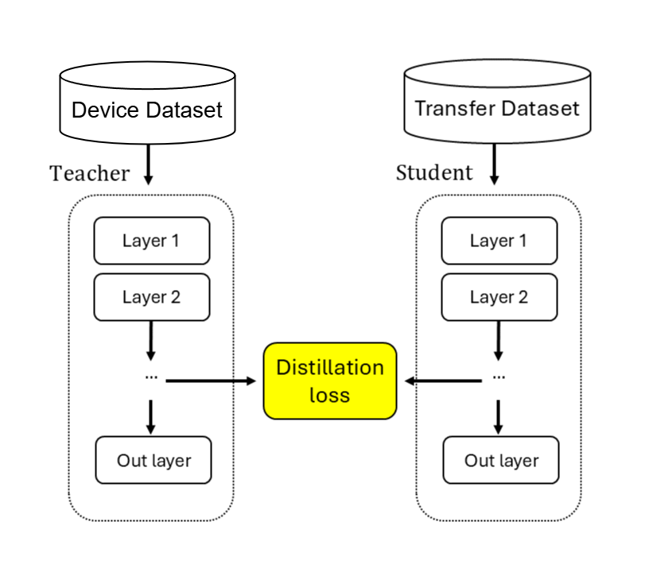

# Lightweight Neural Audio Effects Using Knowledge Distillation

This code repository for the article _Compressing Neural Network Models of Audio Distortion Effects Using Knowledge Distillation Techniques_, accepted at ... conference in ... 2025.

Knowledge distillation is a technique for compressing complex and large "teacher" networks into smaller "student" networks. It offers ways to minimize the computational expenses often associated with neural networks and to optimize models for deployment and real-time usage. In our paper, we explore the application of knowledge distillation for compressing RNN models of audio distortion effects. In particular, we propose an audio-to-audio LSTM architecture for realtime regression tasks where small audio effect networks are trained to mimic the internal representations of more extensive networks, known as feature-based knowledge distillation.

<div align="left">
 
</div>

This repository contains all the necessary utilities to use our knowledge distillation architecture. Find the code and pre-trained models located inside the "./src" folder.

Visit our designated [GitHub page for audio examples]().

<!-- Our distillation architecture was evaluated on three datasets, the Blackstar HT-1 vacuum tube amplifier (HT-1), Electro-Harmonix Big Muff (Big Muff) guitar pedal, and the analog-modeled overdrive plugin DrDrive.

Below are just a few non-parametric examples comparing our distilled student models against regular students networks (non-distilled).

**64 unit networks**
DrDrive - Target - Distilled - NonDistilled
HT-1 - Target - Distilled - NonDistilled

**8 unit networks**
Big Muff - Target - Distilled - NonDistilled -->

### Contents

1. [Datasets](#datasets)
2. [Models](#models)
3. [How to Use](#how-to-use)
4. [VST Download](#vst-download)

<br/>

# Datasets

Our distillation architecture was evaluated on three datasets: the Blackstar HT-1 vacuum tube amplifier (HT-1), Electro-Harmonix Big Muff (Big Muff) guitar pedal, and the analog-modeled overdrive plugin DrDrive. All datasets go in the "src./datasets" folder:
```
./src
├── code
├── datasets
│   ├── drdrive_test.pickle
│   └── drdrive_train.pickle
├── models
```
The DrDrive datasets (both parametric and non-parametric) created for this article can be accessed via [Zenodo](https://doi.org/10.5281/zenodo.15222630). The HT-1 and Big Muff datasets were sourced from the IEEE journal article [Pruning Deep Neural Network Models of Guitar Distortion Effects](https://ieeexplore.ieee.org/abstract/document/9954902/) by David Südholt, Alec Wright, Cumhur Erkut, and Vesa Valimaki, 2023.

# Models

The " ./src/models " folder contains a selection of pre-trained teacher and student models. Although both conditioned and unconditioned versions are listed, conditioned models currently exist only for DrDrive.
```
./src
├── code
├── datasets
├── models
│   ├── conditioned       
│   └── unconditioned
│       ├── students_distilled
│       │   └── LSTM_DEVICE_UNITS (f.ex "LSTM_bigmuff_16")
│       ├── students_distilled_by_64_student
│       ├── students_non_distilled
│       └── teachers 
```
Student models are either *non_distilled*, trained on the normal training data, or *distilled*, trained on transfer data generated by a teacher model (+ the normal test sets). Further, students are constructed with two LSTM layers in addition to their input and output dense layers. The size of the first LSTM layer is customizable through user arguments (see "how to run") while the second layer is always 8 units. Therefore, the naming convention is "architecture_device_number-units-in-the-second-LSTM-layer".

Finally, one experimental model is included in the "./unconditioned/student_distilled_by_64_student" folder. In this case, smaller student models (8 units) have been trained by a larger student model (64 units), instead of teachers.

# How To Use 

First, install Python dependencies:
```
cd ./src/code
pip install -r requirements.txt
```
Next, choose to train a teacher, distilled student, or non-distilled student network. Recommended order of operations:
1. Load datasets into the datasets folder
2. Train the teacher model
3. Create transfer dataset from teacher model (create_transferset)
4. Train non-distilled and distilled student models for comparisons.

The code folder structure:
```
./src
├── code    
│   ├── requirements.txt
│   ├── conditioned
│   └── unconditioned  
│       ├── teacher
│       │   └── starter.py
│       ├── create_transferset 
│       ├── student_distilled 
│       └── student_non_distilled
├── datasets
└── models
``` 
Every subfolder inside ".src/code/" contains its own starter script for running training the networks and running inference from the terminal. The starter scripts also contain necessary documentation on available arguments.

All available options (some apply only to students or teachers): 
* --datasets (array of str) - The names of the datasets to use, for example "--datasets drdrive ht1". (default="drdrive") 
* --model_save_dir (str) - Folder directory in which to store the model and all other results (loss). (default ="./src/models")
* --data_dir (str) - Folder directory in which the datasets are stored (default="./src/datasets")
* --epochs (int) - Number of training epochs. (defaut=60)
* --parameter_number (int) - Number of conditioning parameters (default=0)
* --batch_size (int) - The size of each batch (default=8) 
* --hidden_layer_sizes (array of int) = The hidden layer size (amount of units) of the LSTM network. To train multiple networks with different hidden layer sizes, simply select more than one value. for instance, "--hidden_layer_size 8 16 32" will train three separate networks, each with different units. (default=[8])
* --mini_batch_size (int) - The mini batch size (default=2048) 
* --learning_rate (float) - the initial learning rate (default=3e-4)
* --only_inference (bool) - When True, skips training and runs only inference on the pre-model. When False, runs training and inference on the trained model. (default=False)

Example usage: 
```
cd ./src/code/unconditioned/teacher
python starter.py --datasets bigmuff ht1 --epochs 500
``` 

# VST Download

Coming soon..

<!-- aleks try with neutone
ricc with other. -->
